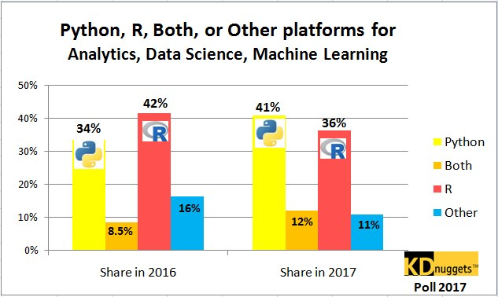
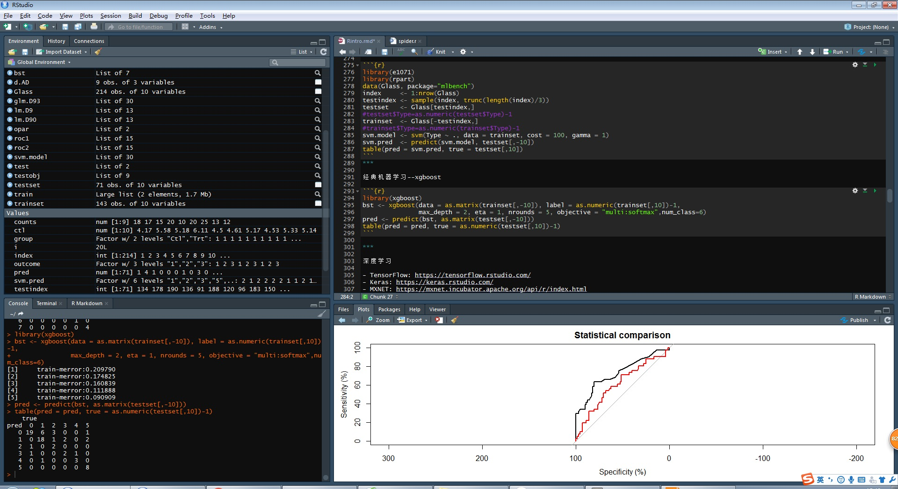
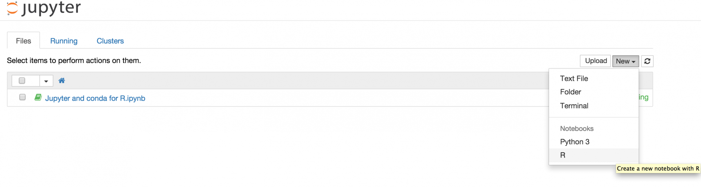

# R环境介绍 {#intro}

## 相关历史

> R is a language and environment for statistical computing and graphics. It is a GNU project which is similar to the S language and environment which was developed at Bell Laboratories (formerly AT&T, now Lucent Technologies) by John Chambers and colleagues.

- 1980年，源于S语言，新西兰奥克兰大学
- 统计计算和图形化



***

优点：

- 免费，开源
- 面向统计分析
- 简单易学
- 可视化非常好
- 完整生态的开发流程
- 社区逐渐扩大


缺点：

- 基于缓存的数据加载
- 运算效率第，对超大数据支持不力
- 国内普及度不高


## 编程环境

- Rstudio



相关[连接](https://www.rstudio.com/products/RStudio/)

***

- Jupyter

```
conda install -c r r-essentials
```



相关[连接](https://www.anaconda.com/developer-blog/jupyter-and-conda-r/)


## 数据类型

- 字符型
- 数值型
- 整数型
- 日期类型
- 逻辑型


```{r,eval=F}
- 字符character: "a", "1", "apple", "@"
```

```{r,eval=F}
- 数值numeric: 1, 3.14, 100, 2e10
```

 
```{r,eval=F}
- 整数integer: 1, 2, 500
```


```{r,eval=F}
- 因子factor: 肝细胞癌（1），肝内胆管癌（2）
```
 
```{r,eval=F}
- 逻辑logical: TRUE, FALSE
```

```{r,eval=F}
- 日期date: 2018-01-19, 19/1/2018
```

## 数据结构

- 因子
- 向量
- 列表
- 矩阵
- 数据框


```{r,eval=F}
- 向量vector: c(1,2,3)，c("a","b","c"), 1:10
```

```{r,eval=F}
- 列表list: list(1,2,3)，list(a="A",b="B",c="C",d=1)
```

```{r,eval=F}
- 矩阵/数组matrix/array: matrix(c(1,2,3,4),ncol=2)
```

```{r,eval=F}
- 数据框data.frame: data.frame(ID=c(1,2,3), 血型=c("A","B","A"))
```


## 控制

- for


```{r}
for ( i in 1:20) {
  
  if (i %% 2==0){
    print(paste(i,"是偶数",sep=""))
  }
  else {
    next
  }
}
```


- if... else
- while...
- repeat
- break
- next


## 函数


```{r,eval=F}
- 函数名：mean(), get_IHC()
```

```{r,eval=F}
- 函数体: 通过body(函数名)查看
```

```{r,eval=F}
- 参数：get_IHC(x, y) 其中x表示文本，y表示要提取的IHC指标
```

## 基本语法

```{r,eval=F}
函数名=function(参数){
  运算逻辑
}

```


```{r}
func=function(x,y){
  return(x/(y+1))
}

func(1,1)
```


## 绘图

## base库中的常用函数

### 算数运算

- +，*， /

```{r}
1:10+2
9/(1:3)-0.5
```

### 统计运算

- mean()，max()，min()，quantile()，sum()，summary()

```{r}
summary(rnorm(100))
```

### 逻辑运算

- &, |, !

```{r}
!(2>1 | 2>3)
```

### 字符串操作

- paste(), grep()，grepl(), strsplit()， strsub()
```{r}
tmp=paste(c(1:10),"163.com",sep="@")
unlist(strsplit(tmp,split="@"))[seq(1,20,2)]
```

### 数据表操作
- subset(), merge(), dim(), names()

```{r}
df=data.frame(x=1:10,y=rep("a",10),stringsAsFactors = F)
dim(subset(df,x>5))
```
### 绘图命令

- plot()，adline()，hist()
```{r,fig.height=5}
hist(rnorm(100))
abline(a=15,b=0)
```

