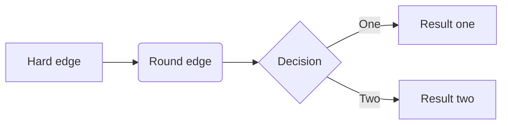

# 文档编写（魏博）

## markdown语言

插入目录

[TOC]

### 三级标题

#### 四级标题

##### 五级标题

### 段落引用

> 段落引用段落引用段落引用段落引用段落引用段落引用段落引用段落引用段落引用段落引用段落引用段落引用段落引用段落引用段落引用段落引用段落引用段落引用段落引用段落引用段落引用段落引用段落引用段落引用段落引用段落引用段落引用段落引用段落引用段落引用段落引用段落引用段落引用段落引用段落引用段落引用段落引用段落引用段落引用段落引用

### 列表

* 无序列表
* 无序列表
* 无序列表

1. 有序列表
2. 有序列表
3. 嵌套列表
   3.1  嵌套列表
   3.2  嵌套列表
4. 有序列表

- [ ] 未完成列表
- [x] 未完成列表

### 插入内容

行内公式$1+2+ \dots+100$

行间公式 

$$1+2+ \dots+100$$

插入图片


### 文本变化

==sd==

**重体**，*斜体*，==高亮==，~~删除线的内容~~, [超链接](www.genowis.con), <u>下划线</u>.

我是^上标^， 我是~下标~，我是[^注释1]

[^注释1]: sdfedf

### 表格

| 项目   |     价格 |  数量  |
| :--- | -----: | :--: |
| 计算机  | \$1600 |  5   |
| 手机   |   \$12 |  12  |
| 管线   |    \$1 | 234  |

### 工程图



### 代码块

```python
@requires_authorization
class SomeClass:
    pass

if __name__ == '__main__':
    # A comment
    print 'hello world'
```

### 分割线

--------

### emoji(建议在关闭源代码模式下，使用自动提示)

:smile:
:cry:
:angry:
:coffee:
:computer:
:calendar:
:email:
:kiss:
:key:


## Rmarkdown
